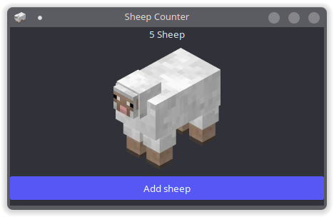

# sheep-counter
A GUI program made in C with GTK+3.0 that counts sheep with audio!

# compiling
Requires [gtk3](https://www.gtk.org/), [SDL2](https://www.libsdl.org/download-2.0.php), and [SDL2_mixer](https://www.libsdl.org/projects/SDL_mixer/)
> With make:
```
make
```
> With gcc:
```
gcc main.c -w `pkg-config --cflags --libs gtk+-3.0` -export-dynamic -l SDL2 -l SDL2_mixer -o sheep-counter
```
